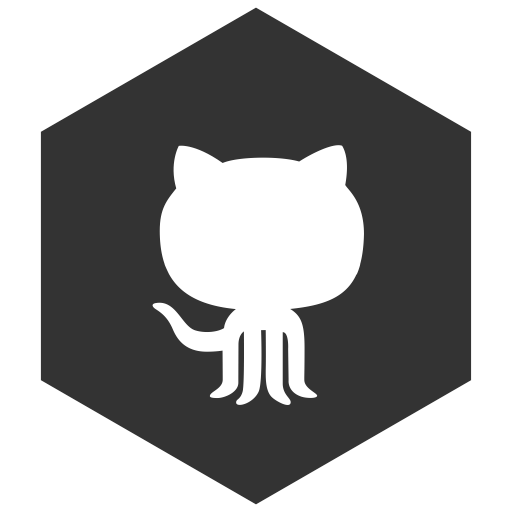
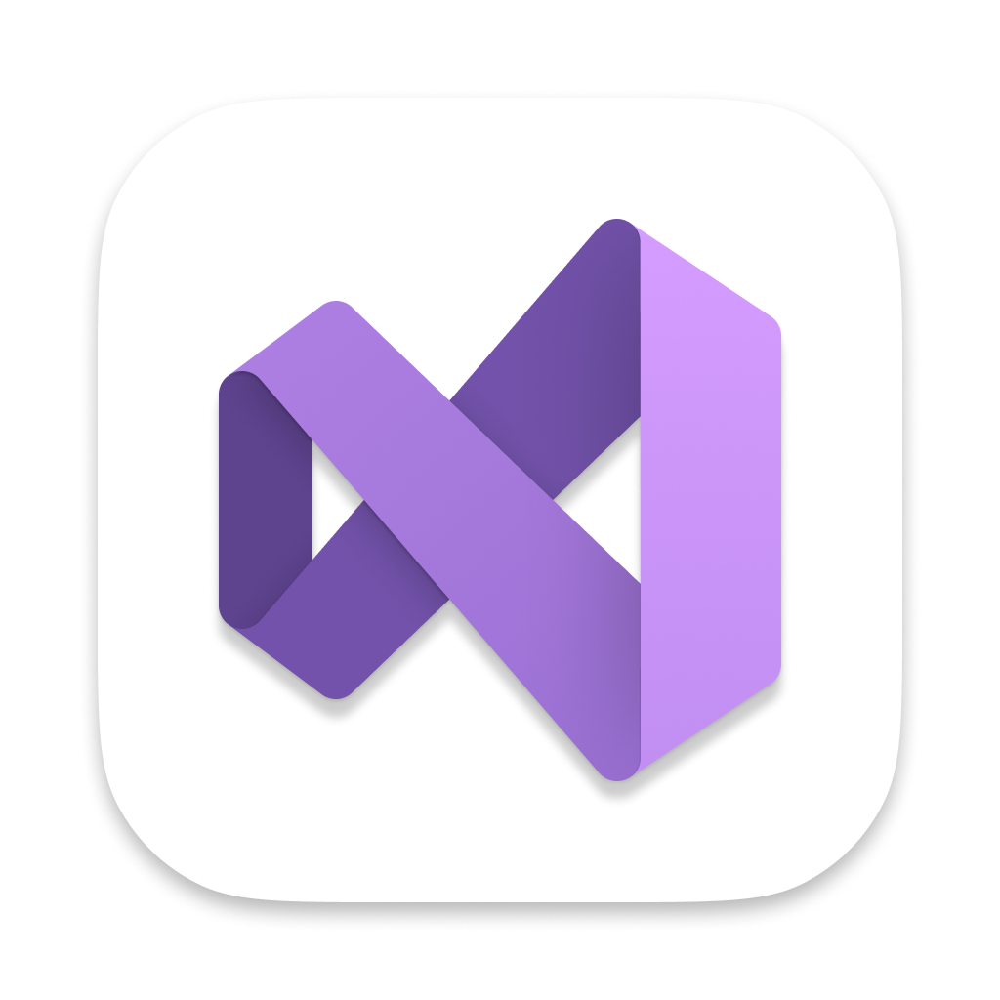
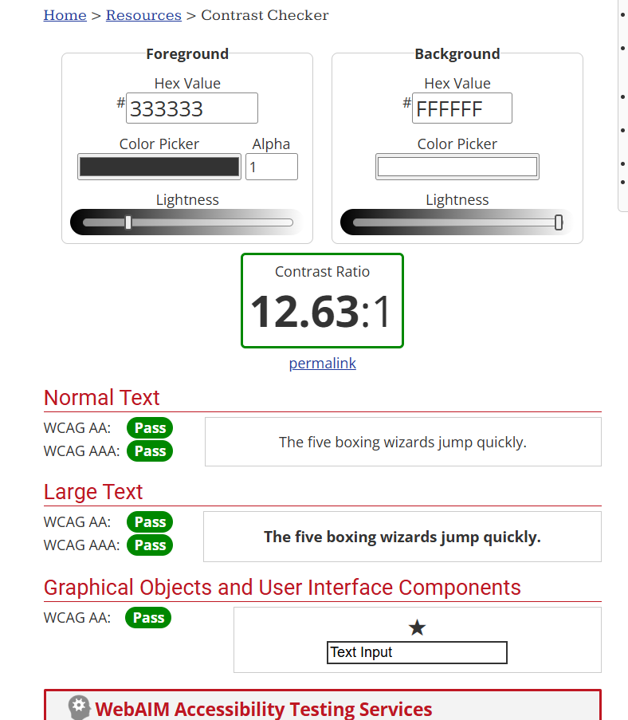
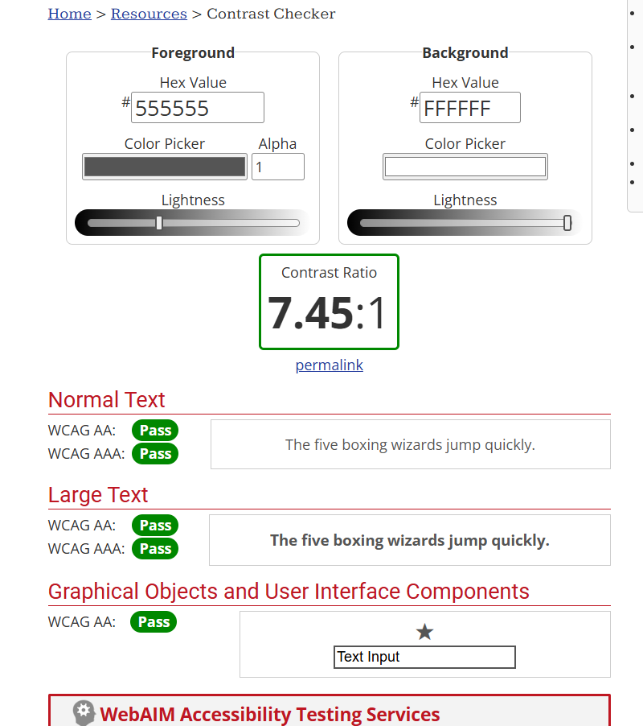
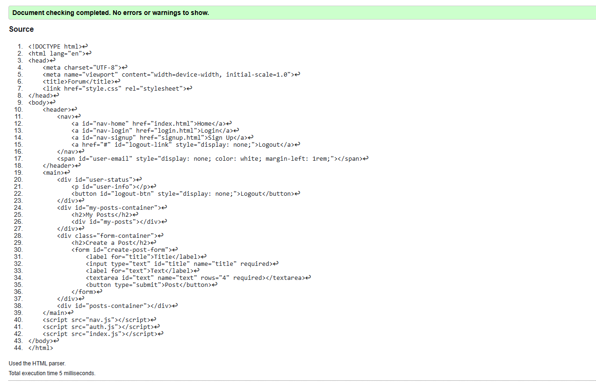
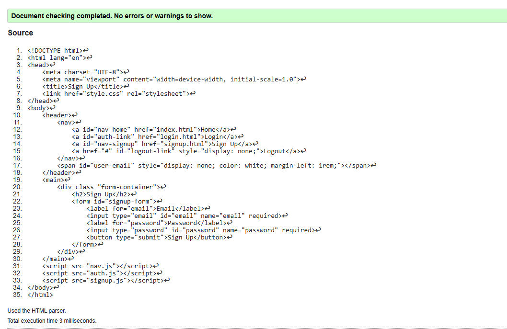
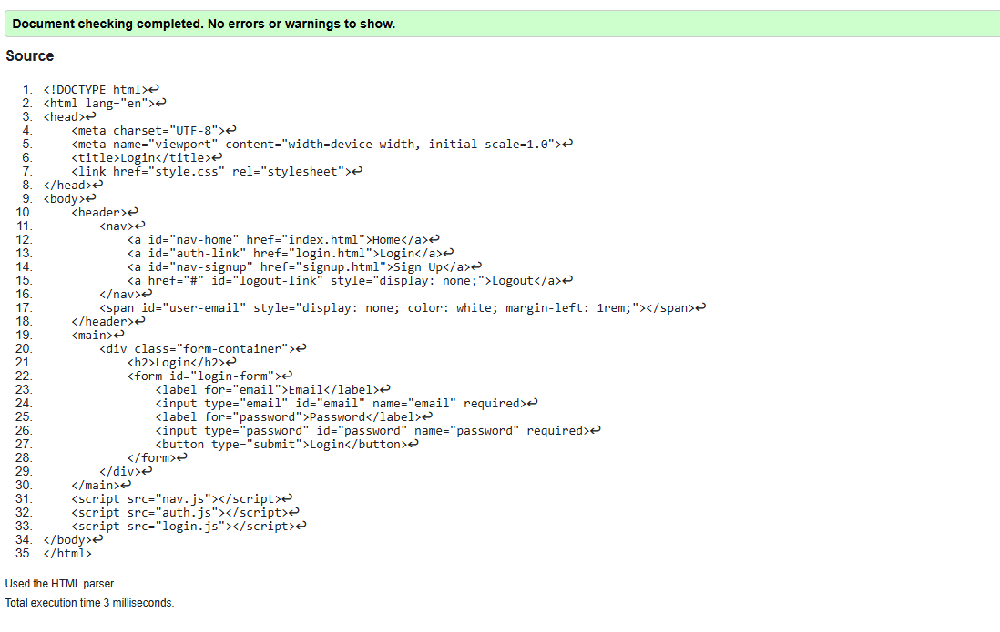
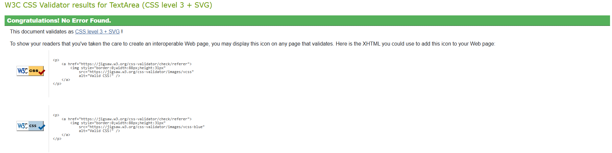
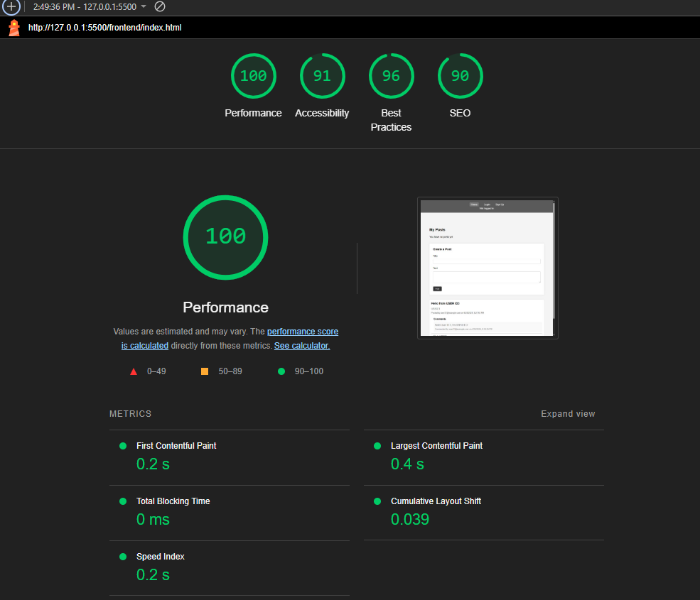
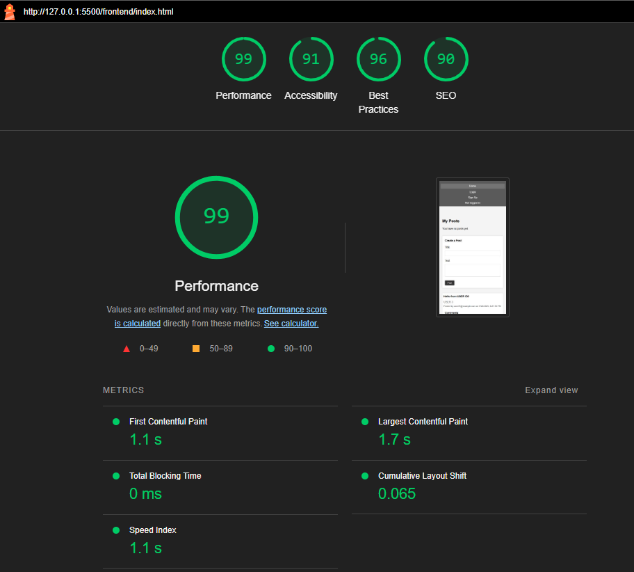

<h1>First Forum - NTV 2025 Final Project </h1>
<h1>Deployment</h1>
    <ul>
        <h2>Using GitHub Pages (Frontend Only)</h2>
        <li>Navigate to the GitHub <a href="https://github.com/LittleCanOpener/First_Forum" target="_blank">Repository</a>:</li>
        <li>Click the 'Settings' Tab.</li>
        <li>Scroll Down to the GitHub Pages Heading.</li>
        <li>Select 'main' or 'master' Branch as the source (ensure the frontend folder is the source).</li>
        <li>Click the Save button.</li>
        <li>Click on the link to go to the live deployed frontend page.</li>
        <li>Note: The backend (API) requires local hosting with ASP.NET Core and cannot be deployed via GitHub Pages. Follow "Run Locally" instructions for the full experience.</li>
    </ul>
    

    <h2><a href="#" target="_blank">Live Preview (Frontend Only)</a></h2>
    

<h1>Run Locally</h1>
    
Follow these steps to set up and run the First Forum project locally on your machine:

    <ul>
        <li>Navigate to the GitHub <a href="https://github.com/LittleCanOpener/First_Forum" target="_blank">Repository</a>:</li>
        <li>Click the Code drop down menu.</li>
        <li>Either Download the ZIP file, unpackage it locally, and open with an IDE (e.g., Visual Studio for backend, VS Code for frontend) OR Copy the Git URL from the HTTPS dialogue box.</li>
        <li>Open your development editor and set up the project as follows:</li>
        <li>For the Backend (API):</li>
        <ul>
            <li>Open a terminal in <code>\First_Forum\backend\ForumApp</code> (adjust path if different).</li>
            <li>Ensure the .NET SDK is installed. If not, download and install it from <a href="https://dotnet.microsoft.com/download" target="_blank">dotnet.microsoft.com</a>.</li>
            <li>Run <code>dotnet restore</code> in the terminal to restore dependencies.</li>
            <li>Run <code>dotnet run</code> to start the API. It will be available at <code>http://localhost:5271</code>.</li>
        </ul>
        <li>For the Frontend:</li>
        <ul>
            <li>Navigate to <code>\First_Forum\frontend</code> in a terminal (adjust path if different).</li>
            <li>Ensure Node.js is installed. If not, download and install it from <a href="https://nodejs.org/" target="_blank">nodejs.org</a>, then run <code>npm install -g http-server</code> to install http-server globally.</li>
            <li>Run <code>http-server -p 8080</code> in the terminal to serve the frontend at <code>http://localhost:8080</code>.</li>
        </ul>
        <li>Open <code>http://localhost:8080/index.html</code> in your browser to access and use the forum.</li>
        <li>Test the application by signing up (e.g., with email <code>user33@example.com</code> and password <code>password123</code>), logging in, creating a post, and adding a comment.</li>
    </ul>
<h1>Technologies</h1>
<h3>GitHub</h3>
    

         
        <a href="https://github.com/" target="_blank">GitHub</a> was used to store and manage the project’s source code, track changes, and collaborate on development.
    

<h4>How to Use GitHub</h4>
    

        Create a repository on GitHub, clone it to your local machine using <code>git clone [URL]</code>, and push changes with <code>git add .</code>, <code>git commit -m "message"</code>, and <code>git push origin main</code>. Use branches for features and pull requests for collaboration.
    

<h4>How It’s Used in First Forum</h4>
    

        GitHub hosted the project repository, allowing version control for both frontend (HTML, CSS, JavaScript) and backend (C# ASP.NET Core) files. It also enabled deployment of the frontend via GitHub Pages.
    

    

<h3>Visual Studio</h3>
    

         
        <a href="https://visualstudio.microsoft.com/" target="_blank">Visual Studio</a> was used as the primary IDE for developing the ASP.NET Core backend.
    

<h4>How to Use Visual Studio</h4>
    

        Install Visual Studio from <a href="https://visualstudio.microsoft.com/" target="_blank">visualstudio.microsoft.com</a>, open the <code>ForumApp.csproj</code> file from the <code>backend/ForumApp</code> directory, and use the terminal to run <code>dotnet restore</code> and <code>dotnet run</code>. Use the "Debug" menu to set breakpoints and debug the code.
    

<h4>How It’s Used in First Forum</h4>
    

        Visual Studio was used to write, debug, and run the backend API (<code>ForumApp</code>). It managed C# code for controllers (<code>PostsController.cs</code>, <code>CommentsController.cs</code>), models, and the database context, ensuring the API functioned correctly.
    

    

<h3>Visual Studio Code</h3>
    

         
        <a href="https://code.visualstudio.com/" target="_blank">Visual Studio Code</a> was used to edit and manage the frontend files.
    

<h4>How to Use Visual Studio Code</h4>
    

        Install VS Code from <a href="https://code.visualstudio.com/" target="_blank">code.visualstudio.com</a>, open the <code>frontend</code> directory, and use the terminal to run <code>http-server -p 8080</code>. Install extensions like "Live Server" for previews or "Prettier" for formatting.
    

<h4>How It’s Used in First Forum</h4>
    

        VS Code was used to write and edit HTML (<code>index.html</code>, <code>login.html</code>), CSS (<code>style.css</code>), and JavaScript (<code>index.js</code>, <code>login.js</code>) files, providing a smooth workflow with syntax highlighting.
    

    

<h3>Node.js and http-server</h3>
    

         
        <a href="https://nodejs.org/" target="_blank">Node.js</a> and <code>http-server</code> were used to serve the frontend locally during development.
    

<h4>How to Use Node.js and http-server</h4>
    

        Install Node.js from <a href="https://nodejs.org/" target="_blank">nodejs.org</a>, then install <code>http-server</code> globally with <code>npm install -g http-server</code>. Navigate to the <code>frontend</code> directory and run <code>http-server -p 8080</code> to serve the site at <code>http://localhost:8080</code>.
    

<h4>How It’s Used in First Forum</h4>
    

        Node.js and <code>http-server</code> hosted the frontend files locally, allowing real-time testing of the forum interface and interaction with the backend API at <code>http://localhost:5271</code>.
    

    

<h3>C# and ASP.NET Core</h3>
    

         
        <a href="https://docs.microsoft.com/en-us/dotnet/csharp/" target="_blank">C#</a> with <a href="https://dotnet.microsoft.com/apps/aspnet" target="_blank">ASP.NET Core</a> was used to build the backend API.
    

<h4>How to Use C# and ASP.NET Core</h4>
    

        Install the .NET SDK from <a href="https://dotnet.microsoft.com/download" target="_blank">dotnet.microsoft.com</a>, open the <code>backend/ForumApp</code> project in Visual Studio, and run <code>dotnet restore</code> followed by <code>dotnet run</code> to start the API at <code>http://localhost:5271</code>.
    

<h4>How It’s Used in First Forum</h4>
    

        C# and ASP.NET Core created the backend API, managing user authentication (<code>UsersController.cs</code>), posts (<code>PostsController.cs</code>), and comments (<code>CommentsController.cs</code>) with RESTful endpoints.
    

    

<h3>HTML</h3>
    

         
        <a href="https://en.wikipedia.org/wiki/HTML" target="_blank">HTML</a> was used to structure the frontend of the forum.
    

    <h4>How to Use HTML</h4>
    

        Open the existing HTML files (<code>index.html</code>, <code>login.html</code>, <code>signup.html</code>) in a text editor like Visual Studio Code. These files use tags like <code>&lt;div&gt;</code>, <code>&lt;form&gt;</code>, and <code>&lt;input&gt;</code> to define the structure. They link to CSS with <code>&lt;link rel="stylesheet" href="style.css"&gt;</code> and JavaScript with <code>&lt;script src="script.js"&gt;</code>. After making changes, test by opening the files in a browser via <code>http://localhost:8080</code> (after starting the frontend server).
    

    <h4>How It’s Used in First Forum</h4>
    

        The project includes pre-built HTML files: <code>index.html</code> (main forum page displaying posts and comments), <code>login.html</code> (login page for users), and <code>signup.html</code> (signup page for new users). These files use HTML to structure forms for user input and sections to display forum content, linking to CSS for styling and JavaScript for interactivity.
    

    

<h3>CSS</h3>
    

         
        <a href="https://en.wikipedia.org/wiki/CSS" target="_blank">CSS</a> was used to style the forum interface.
    

<h4>How to Use CSS</h4>
    

        Create a <code>style.css</code> file, define styles with selectors (e.g., <code>.class</code>, <code>#id</code>), and apply properties like <code>color</code> and <code>margin</code>. Link it to HTML with <code>&lt;link rel="stylesheet" href="style.css"&gt;</code>.
    

<h4>How It’s Used in First Forum</h4>
    

        CSS styled the forum’s UI, including the navigation bar, post containers, and comment sections, ensuring a consistent and user-friendly design.
    

    

<h3>JavaScript</h3>
    

         
        <a href="https://en.wikipedia.org/wiki/JavaScript" target="_blank">JavaScript</a> was used to add interactivity to the frontend.
    

<h4>How to Use JavaScript</h4>
    

        Write JavaScript in files like <code>index.js</code> or <code>login.js</code>, using <code>fetch</code> for API calls and DOM manipulation with <code>document.getElementById</code>. Include scripts in HTML with <code>&lt;script src="script.js"&gt;</code>.
    

<h4>How It’s Used in First Forum</h4>
    

        JavaScript handled dynamic features like fetching posts/comments, managing user signup/login, and updating the UI based on API responses.
    

    

<h3>SQLite</h3>
    

         
        <a href="https://www.sqlite.org/" target="_blank">SQLite</a> was used as the database to store project data.
    

<h4>How to Use SQLite</h4>
    

        Set up SQLite with Entity Framework Core in the backend by configuring a connection in <code>appsettings.json</code>. Use migrations with <code>dotnet ef migrations add InitialCreate</code> and access <code>forum.db</code> with DB Browser for SQLite.
    

<h4>How It’s Used in First Forum</h4>
    

        SQLite stored user data, posts, and comments in <code>forum.db</code>, integrated via the backend to persist and retrieve forum content.
    

    

<h3>DB Browser for SQLite</h3>
    

         
        <a href="https://sqlitebrowser.org/" target="_blank">DB Browser for SQLite</a> was used to inspect and verify the database.
    

<h4>How to Use DB Browser for SQLite</h4>
    

        Download from <a href="https://sqlitebrowser.org/" target="_blank">sqlitebrowser.org</a>, open <code>forum.db</code> from the <code>backend/ForumApp</code> directory, and use the "Browse Data" tab to view tables or "Execute SQL" to run queries.
    

<h4>How It’s Used in First Forum</h4>
    

        DB Browser verified database contents, such as checking hashed passwords in the <code>Users</code> table and confirming posts/comments during testing.
    

    

<h3>Google Chrome Developer Tools</h3>
    

         
        Google Chrome Developer Tools was used for debugging and testing.
    

<h4>How to Use Google Chrome Developer Tools</h4>
    

        Open Chrome, press F12 or right-click and select "Inspect" to access DevTools. Use the "Console" for errors, "Network" for API calls, and "Elements" to modify HTML/CSS.
    

<h4>How It’s Used in First Forum</h4>
    

        DevTools debugged JavaScript issues, monitored API requests, and tested UI adjustments like the "My Posts" section.
    

    

<h3>WebAIM</h3>

         
        Why <a href="https://webaim.org/" target="_blank">WebAIM</a>: WebAIM's mission is to expand the potential of the web for people with disabilities.  
        We empower individuals and organizations to create and deliver accessible content by providing knowledge, technical skills, tools, organizational leadership strategies, and vision. 
        

        

        
Contrast Screenshots.

        

             
            
        

        

<h3>Lighthouse</h3>
    

         
        <a href="https://chrome.google.com/webstore/detail/lighthouse/blipmdconlkpinefehnmjammfjpmpbjk/related?hl=en" target="_blank">Lighthouse</a> was used to analyze the frontend’s performance and accessibility.
    

<h4>How to Use Lighthouse</h4>
    

        In Chrome DevTools, go to the "Lighthouse" tab, select metrics (e.g., Performance, Accessibility), and click "Generate report." Alternatively, install the extension for standalone use.
    

<h4>How It’s Used in First Forum</h4>
    

        Lighthouse evaluated the frontend’s load speed and accessibility, ensuring a good user experience and identifying improvements.
    

<h4>How to Access Lighthouse without Extension</h4>
    <ol>
        <li>Press F12 on your keyboard (Windows) to open Developer Tools, then select the Lighthouse tab.</li>
        <li>Right-click on a page, select "Inspect," and navigate to the Lighthouse tab.</li>
    </ol>
    

<h1>Testing</h1>
    <h3>Code Validators</h3>
    <ul>
        <li>W3C <a href="https://validator.w3.org/nu/#textarea" target="_blank">HTML Checker</a></li>
        
Index File:

        
        
Signup File:

        
        
Login File:

        
        <li>W3C <a href="https://jigsaw.w3.org/css-validator/#validate_by_input" target="_blank">CSS Validator</a></li>
        
Stylesheet:

        
    </ul>
<li>Lighthouse Validator Results:</li>
<h4>Desktop:</h4>
    
<h4>Mobile:</h4>
    
<h2>Lighthouse</h2>
    <h3>Why It's Important to Run Before Deployment</h3>
    

        <strong>Performance:</strong> Ensures pages load quickly, keeping users engaged.
    

    

        <strong>Accessibility:</strong> Makes the site usable for people with disabilities.
    

    

        <strong>Best Practices:</strong> Follows web standards for security and reliability.
    

    

        <strong>SEO:</strong> Boosts search engine visibility.
    

<h1>Features</h1>
    <ul>
        <li>User Signup and Login with Password Hashing (BCrypt).</li>
        <li>Create, View, and Delete Posts (with "My Posts" section).</li>
        <li>Add and Delete Comments on Posts.</li>
        <li>User Authentication and Authorization for Delete Actions.</li>
    </ul>
<h1>Special Thanks & Acknowledgements</h1>
    <ul>
        <li><a href ="https://www.pngegg.com/" target="_blank">Pngegg</a> For icons for the ReadME 
</li>
        <li><a href ="https://favicon.io/" target="_blank">FavIcon</a> Used for the Icon for the website 
</li>
        <li><a href ="https://grok.com/" target="_blank">Grok 3</a> For guidance and Favicon image 
</li>
        <li><a href ="https://stackoverflow.com/" target="_blank">Stackoverflow</a> Used for advanced problems and finding solutions 
</li>
        <li><a href ="https://www.w3schools.com/" target="_blank">W3schools</a> Used for studing, problem solving and finding solutions 
</li>
        <li><a href ="https://fontawesome.com/" target="_blank">FontAwesome</a> For their amazing fonts! 
</li>
    </ul>
    <th>Teachers & Mentors:</th>
<table>
<tr>
    <td>Hjörtur Pálmi Pálsson 
        
    </td>
</tr>
<tr>
    <td>Gunnar Geir Helgason
        
    </td>
</tr>
</table>
